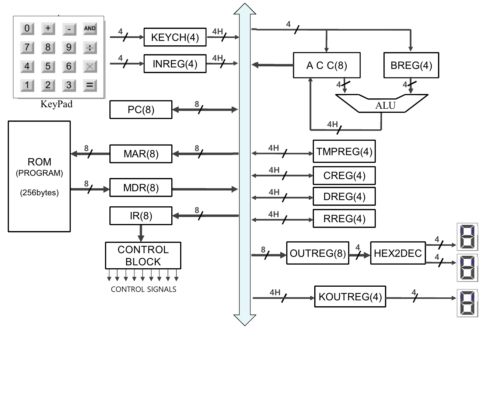

# Simple 4-bit Microprocessor

This repository contains the Verilog HDL implementation of a **Simple 4-bit Microprocessor**. The project is designed and implemented using **Xilinx Vivado**.

## Overview
The microprocessor is capable of performing basic arithmetic and logical operations. It features a custom instruction set architecture (ISA) and is built with a modular design, separating the control unit, datapath, and I/O interfaces.

## Development Environment
- **Tool**: Xilinx Vivado 2022.2
- **Language**: Verilog HDL
- **Target Device**: FPGA (Generic or specific board if applicable)

## System Architecture

The overall system architecture includes the central processing unit (CPU), memory (ROM), and I/O interfaces (Keypad, 7-Segment Display).

### Key Components

#### 1. Central Processing Unit (CPU)
The core of the microprocessor (`processor.v`), responsible for fetching, decoding, and executing instructions.
- **Control Unit**: Generates control signals based on the opcode from the Instruction Register (IR).
- **ALU (Arithmetic Logic Unit)**: Performs operations such as Addition, Subtraction, AND, Multiplication, and Division.
- **Accumulator (ACC)**: 8-bit register that stores the result of ALU operations.
- **Program Counter (PC)**: 8-bit register pointing to the next instruction address in ROM.
- **Registers**:
  - `BREG` (4-bit): Operand register for ALU.
  - `CREG`, `DREG`, `RREG`: General-purpose/Temporary registers.
  - `MAR` (Memory Address Register), `MDR` (Memory Data Register).
  - `INREG` (Input Register), `KEYCH` (Key Check Register).

#### 2. Memory
- **ROM**: 256-bytes program memory implemented using Vivado's Distributed Memory Generator IP (`dist_mem_gen_0`). It stores the instructions to be executed.

#### 3. I/O Interface
- **Input**: Matrix Keypad interface (`ks.v`) scans user input and provides 4-bit data.
- **Output**: 7-Segment Display controller (`seg7x8.v`) visualizes 8-bit data (High/Low nibbles) and status.

## License
This project is open-source and available under the MIT License.
